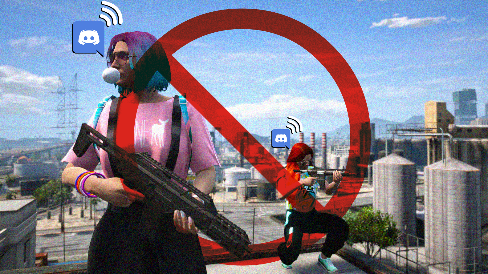

# **Anti Discord Metagaming** 🗣️🚫 [FiveM-Script]
### Simple attempt to reduce discord meta gaming by disconnecting players, if they are not connected to a specific discord voice channel.

<br>

[ ](https://mrm.tebex.io/package/6479548 "FiveM - Anti Discord Metagaming [FiveM-Script] 🗣️🚫 - standalone script") 

<br>

## Features 💼
- 📌 **Players need to be connected to a specific discord voice channel to play on the server.** `[configurable]`
- 🔎 Checks connected players' status constantly. `[configurable]`
- 🙍🏽 Add whitlisted discord user IDs. `[configurable]`
- 💭 Custom kick messages. `[configurable]`
- ⚠️ Automatic update checks. `[configurable]`
- 🎒 Well optimized. `CPU usage 0.00`

---
## Requirements 🧰
- **Discord bot** (_create one using the [Discord Developer Portal](https://discord.com/developers/applications) and add it to your server_)
- Discord voice channel that your bot has access (_make speaking disabled voice channel so connected player's can't speak_)
- This is a **standalone** script. It means this works on any framework. (QB, QBOX, ESX, Whatever)

---
## Installation 🐌

```
- download the script from my tebex.store (link down below ↓)
- unzip the file → mrm-AntiDiscordMeta
- place it somewhere in your server's resource folder
```

```
- add → ensure mrm-AntiDiscordMeta ... to your server.cfg
```
```
- edit the config.lua and fill the Discord section
- restart the server or start the script from console
```

### **📍 Keep in mind:**
> The script will not work, if you change the resource folder name to something else, other than **mrm-AntiDiscordMeta**. 

---

## Configuration File: 📃

```lua
CheckForUpdates = true, -- check for new updates

Time = 3, -- voice channel checking frequency in minutes

Discord = {
    BotToken = "", -- discord bot token (bot must have access to the following voice channel)
    Server_ID = "", -- discord server's ID
    VoiceChannel_ID = "", -- voice channel ID (players need to connect)
},

Whitelisted = { -- add whitelisted user's Discord IDs here (they don't need to be in the voice channel)
    '111111111111111111', -- admin
    '111111111111111111', -- developer
    '111111111111111111', -- staff
},

Messages = {
    ConnectCheck = "Checking discord voice channel connection ...", -- connecting message
    ConnectKick = "Please join the required discord voice channel first !", -- kick message when player is not in the required voice channel

    ServerKick = "Don't leave the required discord voice channel !", -- kick message when player leave the required voice channel
    },
```
---
## 🌎 [Download](https://mrm.tebex.io/package/6479548) :
> You can download the script from my **[Tebex Store](https://mrm.tebex.io/package/6479548)**.

---
> 📽 Demo Video: Soon

<details>
<summary>Tags</summary>
Anti Discord Meta Gaming, FiveM Meta Gaming, FiveM Anti Discord, FiveM Script
</details>